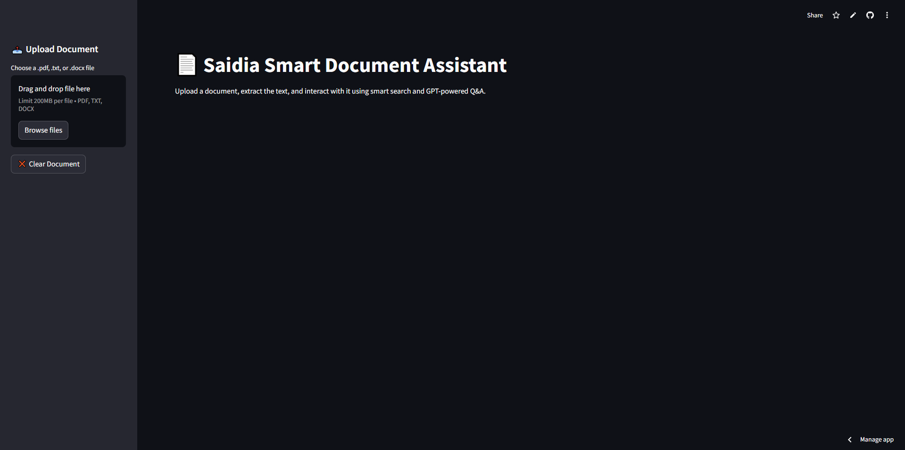
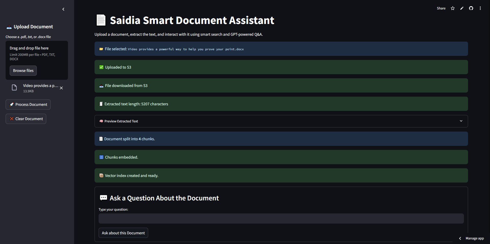
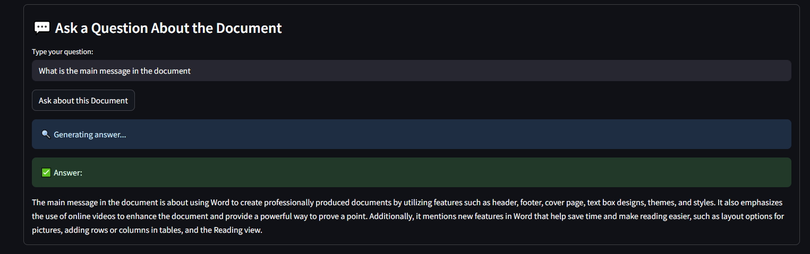

# 📄 Saidia Smart Document Assistant

Saidia is a secure, GPT-powered document assistant that allows users to upload documents, process them privately, and ask natural language questions — all within a clean, private, and user-friendly web app.

👉 **Try the live app here:** [Launch Saidia Smart Assistant](https://smartdocassistant-ibk4wvbdysw7fqkfpkxb7q.streamlit.app/)

## ⚠️ Warning

- Please do not use documents that have sensitive data when trying to use the application as the documents uploaded in the application are store in my AWS S3 bucket.

---

## 🚀 Features

- 🔒 **Secure Document Upload** — Files are stored in AWS S3 bucket
- 🧠 **AI-Powered Q&A** — Uses OpenAI's GPT to answer questions about uploaded documents
- 📄 **Supported File Types** — PDF, DOCX, and TXT
- 🧾 **Text Extraction** — Extracts and processes document content with fallback to OCR.Space if needed
- 🧠 **Semantic Chunking & Embedding** — Text is chunked and embedded using `all-mpnet-base-v2`
- 🔍 **Vector Search** — Uses FAISS to retrieve relevant context for question answering
- ☁️ **Streamlit Cloud Ready** — Fully deployed on Streamlit

---

## 💼 Use Case Example

This assistant is ideal for:
- **HR departments** to make company handbooks searchable
- **Legal teams** to answer questions from contracts or policies
- **Internal teams** to process and search technical documentation
- **Researchers** to query long articles and reports

---

## 🔧 Tech Stack

| Tool                  | Purpose                             |
|-----------------------|-------------------------------------|
| `streamlit`           | Frontend UI                         |
| `boto3`               | AWS S3 storage                      |
| `pdfplumber`, `docx`, `PyMuPDF` | Text + annotation extraction |
| `requests`            | OCR.Space API fallback              |
| `sentence-transformers` | Text embeddings                   |
| `faiss-cpu`           | Vector search                       |
| `openai`              | GPT-3.5-turbo API                   |
| `python-dotenv`       | Local environment setup (optional)  |

---

## 📦 Folder Structure
.
├── saidia_app.py   # Main Streamlit app

├── rag_pipeline.py         # Handles text extraction + OCR

├── s3_upload.py            # Uploads file to AWS S3

├── vector_store.py         # Chunking + FAISS index

├── qa_engine.py            # GPT Q&A engine

├── requirements.txt

└── .streamlit/
    └── secrets.toml        # Your private keys

📌 Notes
- This app uses OpenAI’s API securely; only document chunks are sent for answering questions.

- OCR fallback ensures even scanned PDFs can be processed.

- All files stay private within your AWS S3 bucket.

## 🔑 API Access Keys Required for the application.

##  [aws]
- AWS_ACCESS_KEY_ID = "your_aws_access_key"
- AWS_SECRET_ACCESS_KEY = "your_aws_secret"

## [openai]
- OPENAI_API_KEY = "your_openai_api_key"

## [ocr_space]
- OCR_API_KEY = "your_ocr_space_api_key"

## 🙌 Credits
- Created by Treva Ogwang
- Powered by OpenAI + Streamlit + AWS

## ⚖️ License
This project is licensed under the Creative Commons Attribution-NonCommercial-NoDerivatives 4.0 International (CC BY-NC-ND 4.0).

You may not sell, alter, or use this work commercially without explicit permission from the author.
