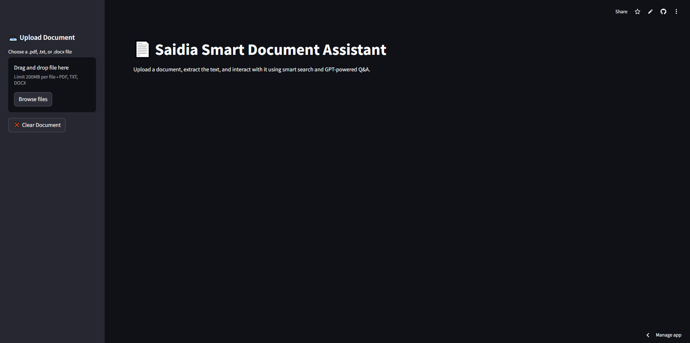
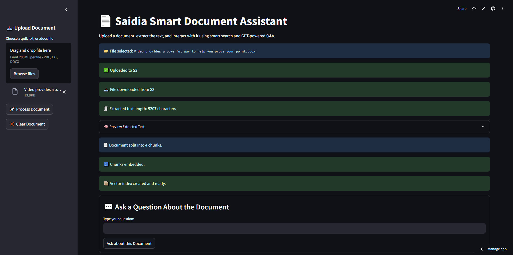
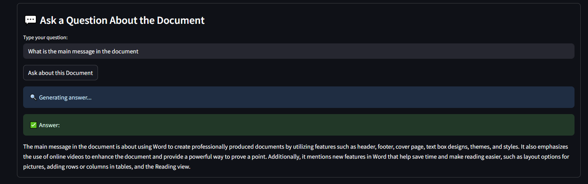

# 📄 Saidia Smart Document Assistant

Saidia is a secure, GPT-powered document assistant that allows users to upload documents, process them privately, and ask natural language questions — all within a clean, private, and user-friendly web app.

👉 **Try the live app here:** [Launch Saidia Smart Assistant](https://smartdocassistant-ibk4wvbdysw7fqkfpkxb7q.streamlit.app/)

## ⚠️ Warning

- Please do not use documents that have sensitive data when trying to use the application as the documents uploaded in the application are store in my AWS S3 bucket.

---

## 🚀 Features

- 🔒 **Secure Document Upload** — Files are stored in AWS S3 bucket
- 🧠 **AI-Powered Q&A** — Uses OpenAI's GPT to answer questions about uploaded documents
- 📄 **Supported File Types** — PDF, DOCX, TXT, JPG, JPEG, and PNG
- 🧾 **Adaptive Text Extraction** — Uses local extraction for digital documents and automatically selects OpenAI Vision for images and scanned PDFs
- ⚡ **Concurrent First-Pass Processing** — Extracts directly from the original upload while S3 storage runs in parallel, avoiding an immediate S3 re-download
- 🧠 **Semantic Chunking & Embedding** — Text is chunked and embedded using `all-mpnet-base-v2`
- 🔍 **Vector Search** — Uses FAISS to retrieve relevant context for question answering
- 🧰 **Agentic Tool Selection** — An OpenAI function-calling controller chooses when to inspect document metadata or search indexed content
- 📚 **Carrier Policy Retrieval** — The agent can compare incidents with a small, clearly labelled fictional evaluation-policy store
- 📋 **Structured Incident Cases** — Converts document facts into a validated case contract and applies deterministic policy, evidence, and deadline checks
- 🔗 **One-Click Automatic Case Handoff** — Processing a document also analyzes its incident and sends the validated, versioned case to Make.com; operational human handling belongs in Jira
- 🗄️ **PostgreSQL Persistence** — Persists real processed-document metadata in hosted Supabase PostgreSQL via `DATABASE_URL`
- ☁️ **Streamlit Cloud Ready** — Fully deployed on Streamlit

---

## 💼 Use Case Example

This assistant is ideal for:
- **HR departments** to make company handbooks searchable
- **Legal teams** to answer questions from contracts or policies
- **Internal teams** to process and search technical documentation
- **Researchers** to query long articles and reports

---

## 🔧 Tech Stack

| Tool                  | Purpose                             |
|-----------------------|-------------------------------------|
| `streamlit`           | Frontend UI                         |
| `boto3`               | AWS S3 storage                      |
| `pdfplumber`, `docx`, `PyMuPDF` | Text, annotation, image, and scanned-PDF preparation |
| `sentence-transformers` | Text embeddings                   |
| `faiss-cpu`           | Vector search                       |
| `openai`              | Document Q&A, agent tool selection, and automatic vision transcription |
| `psycopg`             | PostgreSQL document persistence        |
| `python-dotenv`       | Local environment setup (optional)  |

---

## 📦 Folder Structure
.
| saidia_app.py         | Main Streamlit app                   |
|-----------------------|--------------------------------------|
| rag_pipeline.py       | Inspects files and selects local or vision extraction |
| s3_upload.py          | Uploads file to AWS S3               |
| vector_store.py       | Chunking + FAISS index               |
| qa_engine.py          | GPT Q&A engine                       |
| agent_engine.py       | Bounded read-only document agent and tool controller |
| policy_store.py       | Read-only fictional carrier-policy lookup |
| vision_engine.py      | Automatic OpenAI image transcription |
| incident_case.py      | Structured case validation and deterministic policy analysis |
| case_handoff.py       | Versioned processed-case handoff to Make |
| database.py           | PostgreSQL document persistence       |
| requirements.txt      | .streamlit/-secrets.toml-Private Keys|

📌 Notes
- For digital documents, only retrieved document chunks are sent to OpenAI when answering questions.

- Images and rendered pages from scanned PDFs are sent to OpenAI Vision automatically when usable native text is unavailable; the app displays this routing clearly.

- Original uploads are stored in a private AWS S3 bucket; selected document content is processed by OpenAI as described above.

- The agent can inspect metadata, search already-processed content, and read fictional evaluation policies. Its tools cannot modify files, delete objects, send messages, or perform external actions.

- Selecting **Process Document** performs extraction, PostgreSQL persistence, incident analysis, and Make handoff in one workflow. Extraction uses the original uploaded bytes while S3 upload runs concurrently; semantic embeddings are deferred until the first chat question so they do not delay the Jira result. Streamlit leads with the Jira result, keeps detailed case analysis collapsed for inspection, and does not approve or reject cases locally.

- Make may return a JSON `jira_result` containing `issue_key`, `title`, `routing`, `status`, `recommended_action`, and optional `jira_url`. Streamlit displays these recruiter-friendly fields without requiring Jira access. Until the external Make scenario returns that JSON, the app displays a successful handoff receipt only.

## 🔑 API Access Keys Required for the application.

##  [aws]
- AWS_ACCESS_KEY_ID = "your_aws_access_key"
- AWS_SECRET_ACCESS_KEY = "your_aws_secret"

## [openai]
- OPENAI_API_KEY = "your_openai_api_key"
- QA_MODEL = "gpt-5.6-sol" # optional override
- VISION_MODEL = "gpt-5.6-sol" # optional override

## [make]
- WEBHOOK_URL = "https://hook.example.make.com/your_private_webhook" # keep private

## Database
- DATABASE_URL = "postgresql://..." # hosted PostgreSQL connection string; keep private

## 🙌 Credits
- Created by Treva Ogwang
- Powered by OpenAI + Streamlit + AWS

## ⚖️ License
This project is licensed under the Creative Commons Attribution-NonCommercial-NoDerivatives 4.0 International (CC BY-NC-ND 4.0).

You may not sell, alter, or use this work commercially without explicit permission from the author.
